# Manual do Administrador — Site Marco Mayor

**Guia de gerenciamento de publicações e categorias**

Versão 1.0 · Setembro de 2026 · https://marco-mayor.vercel.app

> Arquivo-fonte editável do manual. A versão diagramada fica em `manual-administrador.html` (estilos em `manual.css`) e o PDF final em `Manual_Administrador_Marco_Mayor.pdf`. As capturas de tela ficam em `img/`. Ao alterar o texto aqui, replique a mudança no HTML e gere o PDF novamente (ver “Como gerar o PDF”, no fim deste arquivo).

---

## Sumário

1. Apresentação
2. Acessando o painel
3. Visão geral do painel
4. Publicações — 4.1 Lista · 4.2 Criar · 4.3 Imagem · 4.4 Publicar e despublicar · 4.5 Destaque · 4.6 Editar · 4.7 Alterar a ordem · 4.8 Excluir
5. Categorias — 5.1 Lista · 5.2 Criar · 5.3 Escolher o ícone · 5.4 Editar · 5.5 Reorganizar · 5.6 Excluir
6. Filtros no site
7. Tempo de atualização do site
8. Boas práticas
9. Dúvidas e problemas comuns

**Como ler este manual:** os nomes de botões e campos aparecem em **negrito**, exatamente como estão no painel. Os números nas imagens correspondem às legendas.

---

## 1. Apresentação

O painel administrativo é a área restrita do site onde você gerencia os conteúdos exibidos na seção **Atuação em destaque** e organiza esses conteúdos por categorias.

Tudo é feito pelo navegador, com formulários simples. Não é preciso instalar programas nem pedir alterações técnicas para as tarefas do dia a dia.

### O que você pode fazer

- **Criar e editar publicações:** título, resumo, link da publicação original e imagem opcional.
- **Controlar o que aparece:** publicar, voltar para rascunho, destacar e definir a ordem dos cards.
- **Organizar por categorias:** criar, renomear, ordenar e excluir categorias, com um ícone para cada uma.
- **Acompanhar o conteúdo:** ver totais, publicações por categoria e as últimas alterações.

### Conceitos importantes

| Termo | O que significa |
| --- | --- |
| Publicação | Cada card exibido na seção Atuação em destaque do site. |
| Categoria | O assunto de uma publicação, como Saúde, Inclusão ou Bairros. As categorias também viram filtros no site. |
| Publicada | A publicação está visível no site. |
| Rascunho | A publicação existe no painel, mas não aparece no site. |
| Destaque | A publicação aparece antes das outras, em um card azul. |
| Atualização do site | Depois que você salva, o site leva alguns instantes para mostrar a mudança (capítulo 7). |

---

## 2. Acessando o painel

O painel fica em um endereço próprio e só pode ser acessado com usuário e senha.

1. Abra o navegador e acesse **https://marco-mayor.vercel.app/admin**
2. No campo **Usuário**, informe **[usuário fornecido pelo administrador]**.
3. No campo **Senha**, informe **[senha fornecida pelo administrador]**.
4. Clique em **Entrar**. Você será levado à tela **Visão geral**.

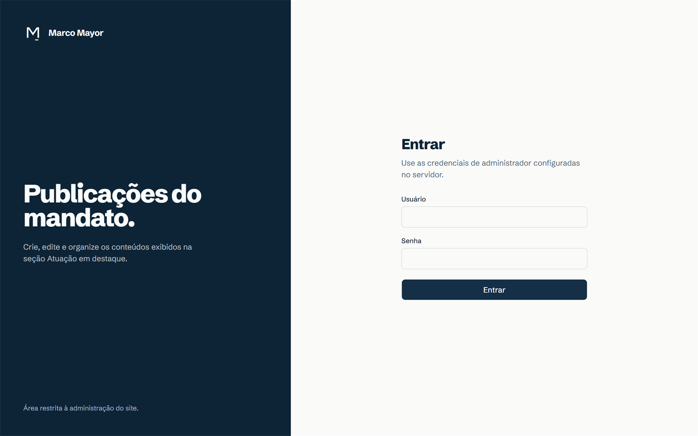

> **Sessão:** por segurança, o acesso expira depois de algumas horas. Se isso acontecer, basta entrar novamente. Para encerrar o acesso a qualquer momento, use **Sair**, no rodapé do menu lateral.

> **Atenção:** após várias tentativas com senha incorreta, o acesso é bloqueado temporariamente e o painel informa quantos minutos aguardar. Nunca compartilhe sua senha.

---

## 3. Visão geral do painel

Ao entrar, você vê um resumo do conteúdo do site. O menu lateral, à esquerda, leva a todas as áreas do painel.

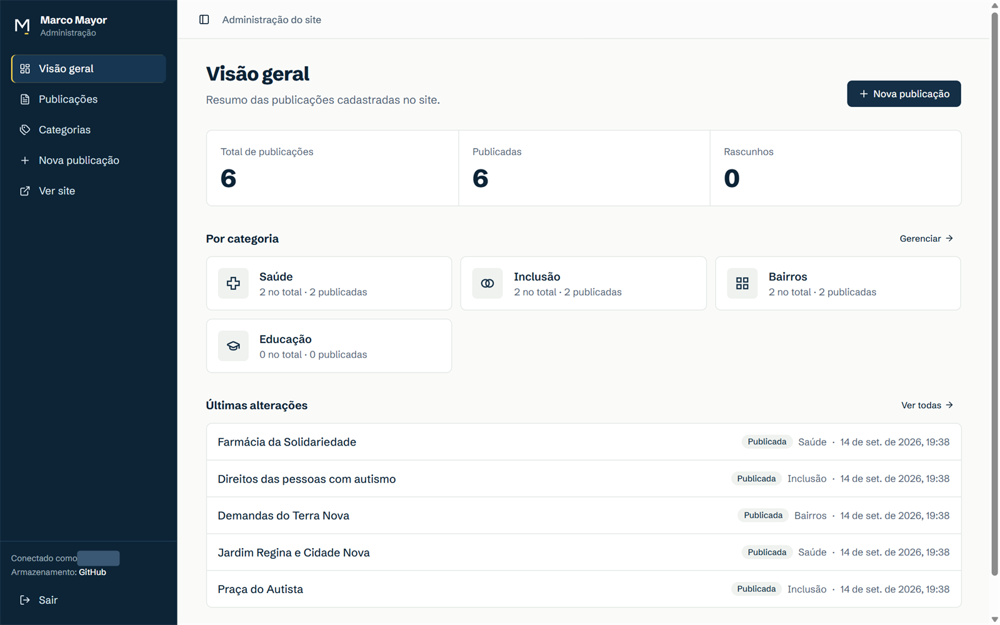

1. **Publicações** — lista com todos os cards do site.
2. **Categorias** — assuntos usados para organizar e filtrar as publicações.
3. **Nova publicação** — atalho para criar um card. Aparece no menu e no topo da tela.
4. **Ver site** — abre o site público em uma nova aba.
5. **Sair** — encerra o acesso ao painel.
6. **Totais** — quantidade de publicações, quantas estão publicadas e quantas são rascunhos.
7. **Por categoria** — quantidade de publicações em cada assunto. O link **Gerenciar** abre Categorias.
8. **Últimas alterações** — as cinco publicações modificadas mais recentemente. Clique em uma para editá-la.

> **No celular:** o painel também funciona no celular. Nesse caso, o menu lateral fica recolhido: toque no botão de menu, no topo da tela, para abri-lo.

---

## 4. Publicações

Cada publicação é um card da seção Atuação em destaque. Nesta área você cria, altera, organiza e remove esses cards.

### 4.1 Lista de publicações

Clique em **Publicações**, no menu lateral. A lista mostra os cards na mesma ordem em que aparecem no site.

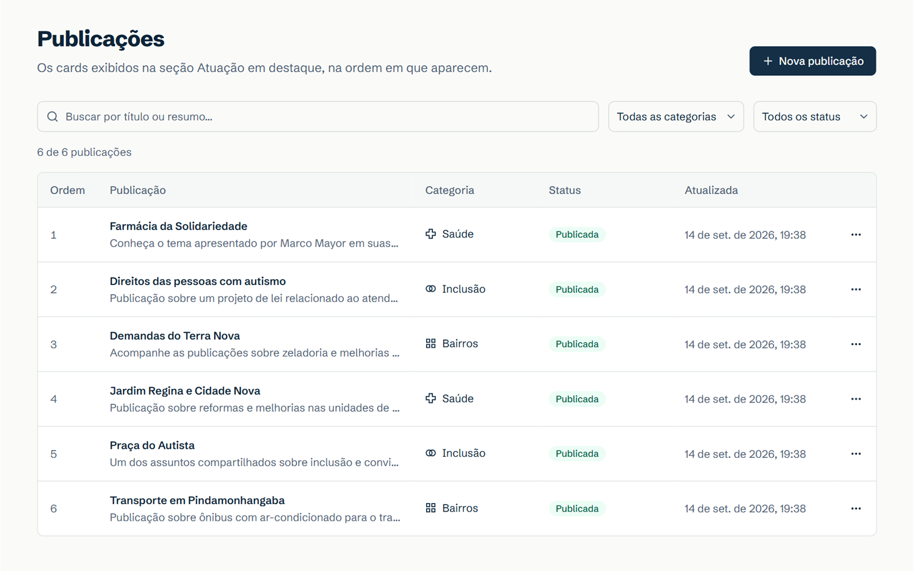

| Elemento | Para que serve |
| --- | --- |
| Busca | Encontra publicações pelo título ou pelo resumo. |
| Filtros | **Todas as categorias** e **Todos os status** limitam a lista a uma categoria ou a publicadas/rascunhos. |
| Colunas | Ordem, título e resumo, categoria, status (Publicada, Rascunho, Destaque, Imagem) e data da última alteração. |
| Título | Clique no título para abrir a publicação e editá-la. |
| Menu de ações (⋯) | Atalhos para editar, publicar, destacar, mudar a ordem e excluir (seções 4.4 a 4.8). |

### 4.2 Criar uma publicação

Clique em **Nova publicação**, no menu lateral ou no topo da lista. Preencha os campos e acompanhe o resultado na pré-visualização, à direita.

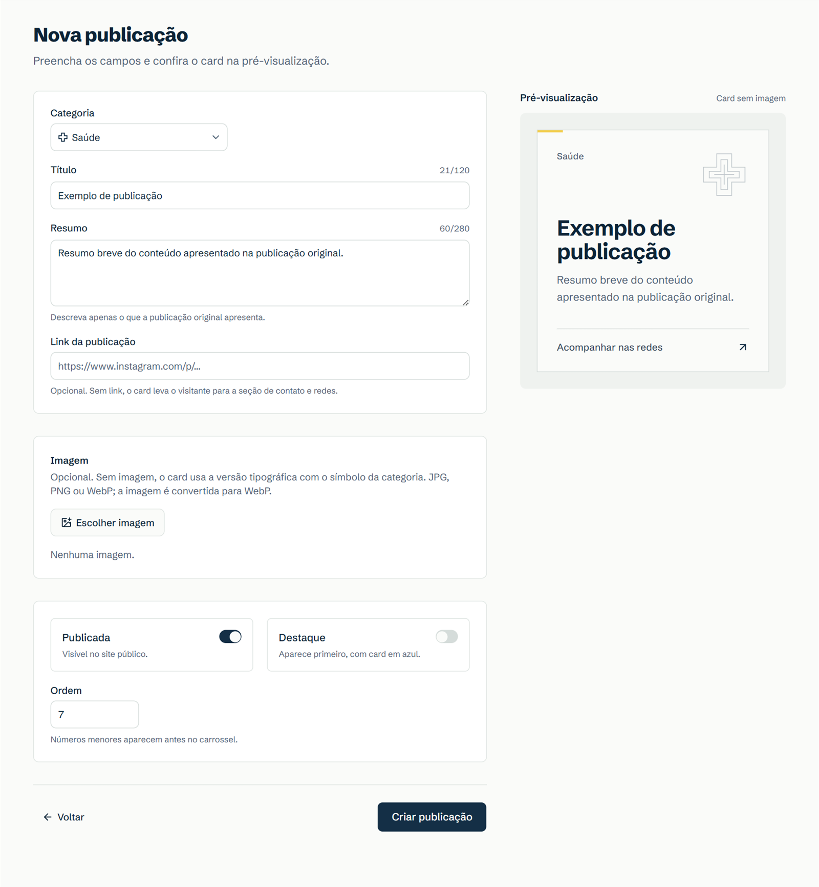

1. **Categoria** — o assunto da publicação. A lista mostra as categorias cadastradas.
2. **Título** — obrigatório, de 3 a 120 caracteres. É o texto em destaque no card.
3. **Resumo** — até 280 caracteres. Descreva apenas o que a publicação original apresenta.
4. **Link da publicação** — opcional. Endereço completo, começando com https://. Com link, o card mostra **Ver publicação** e abre esse endereço; sem link, mostra **Acompanhar nas redes** e leva à seção de contato do site.
5. **Imagem** — opcional. Veja a seção 4.3.
6. **Publicada** e **Destaque** — definem se o card aparece no site e se ele fica em destaque (seções 4.4 e 4.5).
7. **Ordem** — números menores aparecem antes (seção 4.7). O painel já sugere o próximo número.
8. **Criar publicação** — salva o card.
9. **Pré-visualização** — mostra como o card ficará no site, enquanto você digita.

#### Passo a passo

1. Clique em **Nova publicação**.
2. Escolha a **Categoria**.
3. Preencha **Título** e **Resumo**.
4. Se houver, cole o **Link da publicação** original.
5. Opcionalmente, adicione uma imagem (seção 4.3).
6. Ative **Publicada** para o card aparecer no site, ou deixe desativado para salvar como rascunho.
7. Confira a pré-visualização e clique em **Criar publicação**.

Depois de salvar, o painel mostra uma confirmação e abre a tela de edição da nova publicação.

> **Atenção:** após salvar uma alteração, aguarde alguns instantes para que o site seja atualizado. A mensagem de confirmação pode dizer que o site será atualizado “após o próximo deploy”, o que significa apenas que uma nova versão do site está sendo preparada automaticamente.

> **Se algo estiver incorreto:** quando um campo não é aceito, por exemplo um título muito curto ou um link sem https://, o painel mostra **Revise os campos destacados** e indica o problema logo abaixo do campo. Corrija e salve novamente.

> **Alterações não salvas:** se você tentar sair da página com alterações ainda não salvas, o navegador pede confirmação. Assim você não perde o que digitou por engano.

### 4.3 Imagem da publicação

<!-- Seção propositalmente genérica sobre formato/enquadramento: o tratamento das imagens nos cards pode mudar. Atualize aqui e no HTML quando isso acontecer. -->

A imagem é opcional. Sem imagem, o card usa a versão tipográfica com o símbolo da categoria. Com imagem, a foto aparece no topo do card.

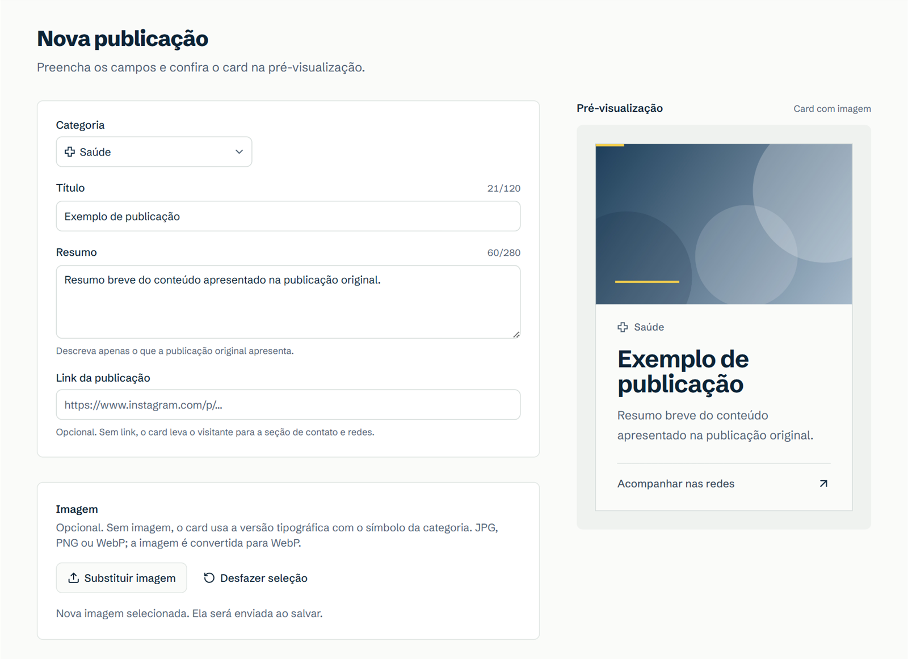

#### Adicionar uma imagem

1. Na área **Imagem**, clique em **Escolher imagem**.
2. Selecione o arquivo no computador ou no celular.
3. Confira a pré-visualização. Se mudar de ideia, clique em **Desfazer seleção**.
4. Clique em **Criar publicação** ou **Salvar alterações**. A imagem só é enviada ao salvar.

#### Arquivos aceitos

- Formatos **JPG, JPEG, PNG** ou **WebP**.
- O painel reduz e otimiza a imagem automaticamente antes de enviar.
- Arquivos muito grandes podem ser recusados; nesse caso, o painel avisa e você pode escolher outra imagem.

#### Recomendações

- Use imagens de boa qualidade e relacionadas ao conteúdo.
- Evite imagens muito pequenas ou pixeladas.
- Confira o enquadramento na pré-visualização antes de salvar.

#### Substituir ou remover uma imagem existente

Em uma publicação que já tem imagem, a área **Imagem** mostra a imagem atual e duas opções:

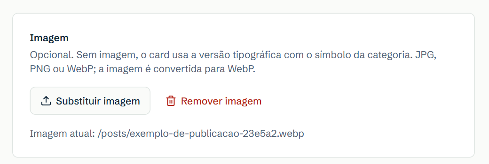

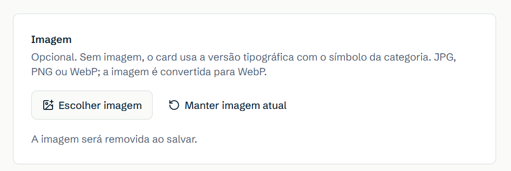

1. Abra a publicação (seção 4.6).
2. Clique em **Substituir imagem** e selecione o novo arquivo, ou clique em **Remover imagem**.
3. Confira a pré-visualização e clique em **Salvar alterações**.

> **Atenção — a imagem pode demorar alguns instantes:** depois de salvar uma publicação com imagem nova, o painel é atualizado antes de o site terminar de publicar a nova versão. Por isso, a imagem pode não aparecer imediatamente, nem no site nem na pré-visualização do painel. Aguarde alguns instantes e atualize a página. Não é necessário enviar a imagem de novo.

> **Sobre o formato das imagens:** não há uma medida ou proporção obrigatória. O site ajusta a imagem ao espaço do card e, dependendo do formato da foto, pode cortar parte das bordas. Por isso, sempre confira a pré-visualização antes de salvar.

### 4.4 Publicar e despublicar

Uma publicação pode estar **Publicada**, visível no site, ou em **Rascunho**, guardada apenas no painel. Rascunhos são úteis para preparar um conteúdo antes de exibi-lo.

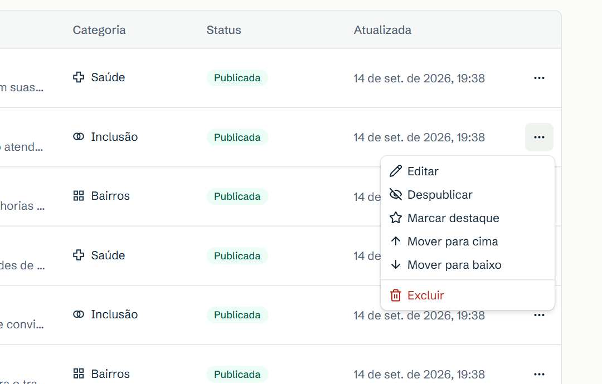

- **Pelo formulário:** na tela da publicação, ative ou desative **Publicada** e clique em **Salvar alterações**.
- **Pela lista (atalho):** clique em **⋯** na linha da publicação e escolha **Publicar** ou **Despublicar**. A alteração é salva na hora.

Enquanto a publicação é um rascunho, a pré-visualização mostra: “Rascunho: este card não aparece no site até ser publicado.”

### 4.5 Destaque

Uma publicação em destaque:

- aparece **antes das demais** no carrossel do site;
- é exibida em um **card azul**, com a etiqueta amarela **Destaque**.

Para destacar, ative **Destaque** no formulário e salve, ou use **⋯ › Marcar destaque** na lista. Para desfazer, desative a opção ou use **Remover destaque**.

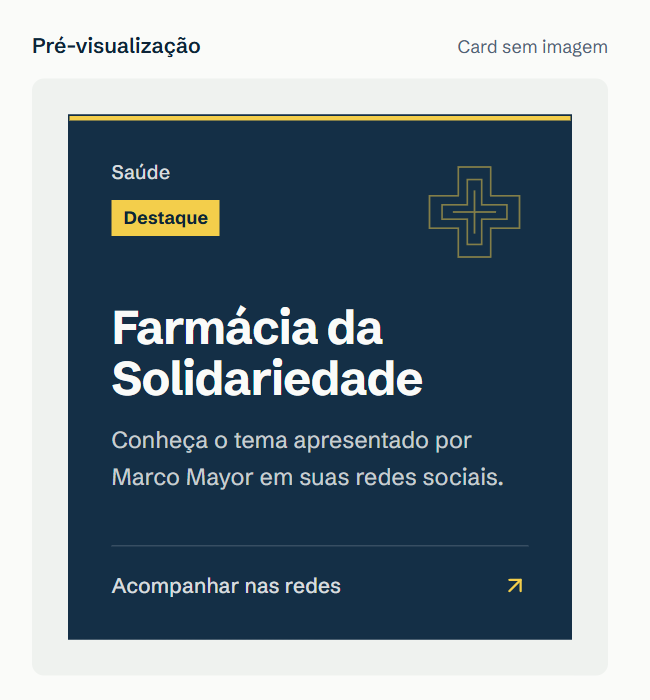

> **Dica:** mais de uma publicação pode estar em destaque ao mesmo tempo. Entre elas, vale a ordem definida no campo **Ordem**. Use o recurso com moderação para que o destaque continue chamando atenção.

### 4.6 Editar uma publicação

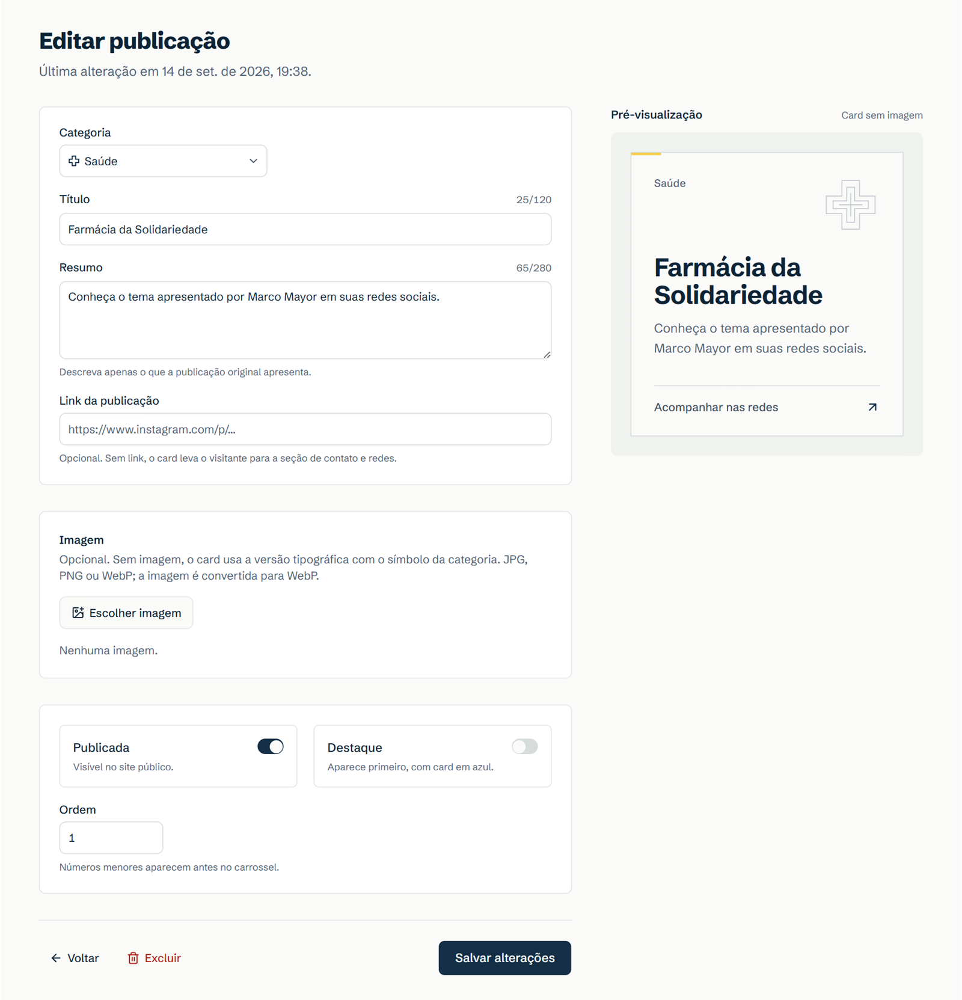

1. Em **Publicações**, clique no título da publicação, ou use **⋯ › Editar**.
2. Altere os campos desejados. A pré-visualização acompanha as mudanças.
3. Clique em **Salvar alterações**.

No rodapé do formulário também ficam:

- **Voltar:** retorna à lista sem salvar.
- **Excluir:** remove a publicação (seção 4.8).

> **Dica:** você também chega à edição clicando em uma publicação da área **Últimas alterações**, na Visão geral.

### 4.7 Alterar a ordem

No site, as publicações em destaque aparecem primeiro. Em seguida, as demais seguem a ordem numérica: números menores aparecem antes. Há duas formas de mudar a posição:

- **Mover para cima ou para baixo:** na lista, clique em **⋯** e escolha **Mover para cima** ou **Mover para baixo**. A publicação troca de lugar com a vizinha e a numeração é reorganizada automaticamente.
- **Campo Ordem:** no formulário da publicação, informe um número no campo **Ordem** e salve. Útil para posicionar um card diretamente.

> **Atenção:** as opções **Mover para cima** e **Mover para baixo** só aparecem quando a lista não está filtrada. Se houver busca ou filtro ativo, o painel avisa “Limpe os filtros para reordenar”.

### 4.8 Excluir uma publicação

1. Na lista, clique em **⋯ › Excluir**, ou abra a publicação e clique em **Excluir**.
2. Leia a confirmação.
3. Se a publicação tiver imagem, decida se deseja marcar **Remover também a imagem associada**.
4. Clique em **Excluir publicação** para confirmar, ou em **Cancelar** para desistir.

Se a mesma imagem for usada por outra publicação, o painel mantém o arquivo e avisa na própria confirmação.

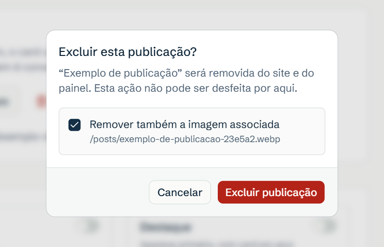

> **Cuidado — a exclusão é definitiva:** a publicação é removida do site e do painel e não pode ser recuperada pelo painel. Se a intenção é apenas tirar o card do site por um tempo, prefira **Despublicar**: o conteúdo continua guardado como rascunho.

---

## 5. Categorias

Categorias são os assuntos das publicações. Elas organizam o painel e geram os filtros da seção Atuação em destaque. Inicialmente, o site possui **Saúde**, **Inclusão** e **Bairros**, e novas categorias podem ser criadas a qualquer momento, sem alteração técnica.

### 5.1 Lista de categorias

Clique em **Categorias**, no menu lateral. Cada linha mostra o ícone, o nome, quantas publicações usam a categoria e quantas delas estão publicadas.

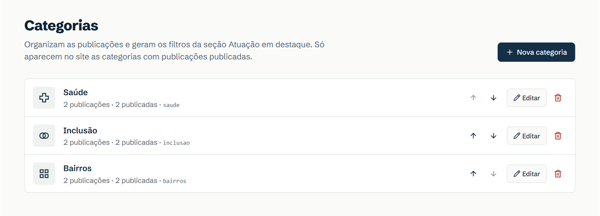

1. **Nova categoria** — cria uma categoria (seção 5.2).
2. **Setas** — sobem ou descem a categoria na ordem (seção 5.5).
3. **Editar** — abre a categoria para alteração (seção 5.4).
4. **Lixeira** — exclui a categoria, se ela não tiver publicações (seção 5.6).

> **Identificador:** o texto em letras menores ao lado das contagens (por exemplo, **saude**) é o identificador interno da categoria. Ele é criado automaticamente e não precisa ser alterado.

### 5.2 Criar uma categoria

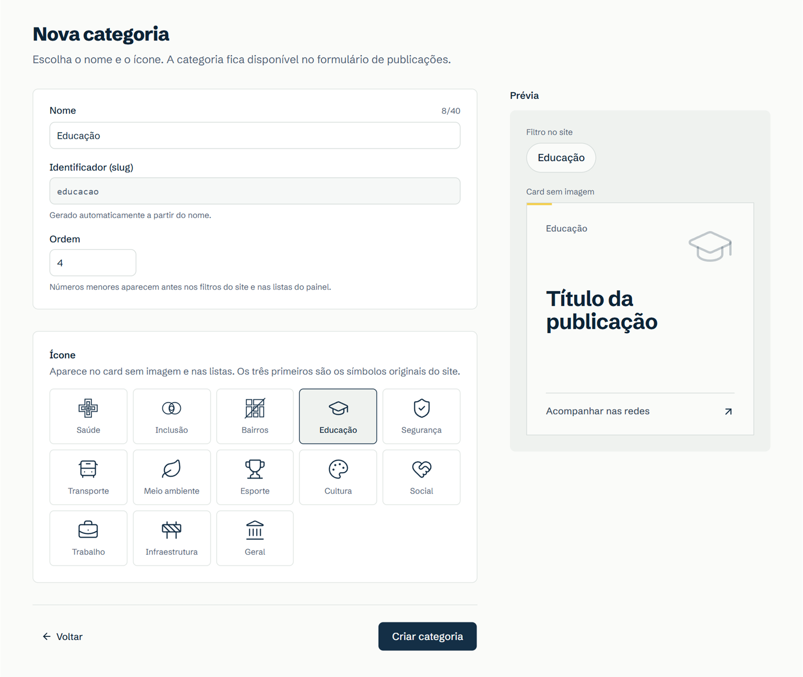

1. **Nome** — de 2 a 40 caracteres. Não pode repetir o nome de outra categoria, mesmo com letras maiúsculas, espaços ou acentos diferentes.
2. **Identificador (slug)** — preenchido automaticamente a partir do nome. Não é editável e não exige nenhuma ação.
3. **Ordem** — números menores aparecem antes nos filtros do site e nas listas do painel.
4. **Ícone** — símbolo exibido no card sem imagem e nas listas (seção 5.3).
5. **Prévia** — mostra como ficam o filtro e o card sem imagem.
6. **Criar categoria** — salva a nova categoria.

#### Passo a passo

1. Entre em **Categorias** e clique em **Nova categoria**.
2. Informe o **Nome**.
3. Selecione um **Ícone**.
4. Confira a **Prévia** e clique em **Criar categoria**.

A nova categoria passa a aparecer no campo **Categoria** das publicações. No site, ela aparece como filtro assim que houver ao menos uma publicação publicada nela (capítulo 6).

### 5.3 Escolher o ícone

Os ícones são predefinidos e seguem o estilo visual do site. Basta clicar no desejado; ele fica marcado com uma borda. Não é necessário, nem possível, enviar arquivos de ícone.

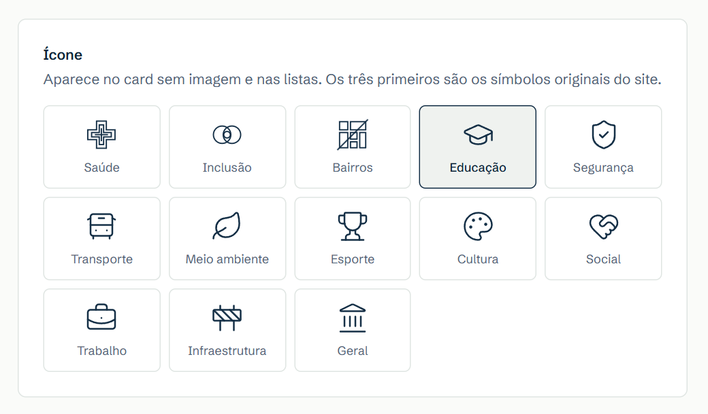

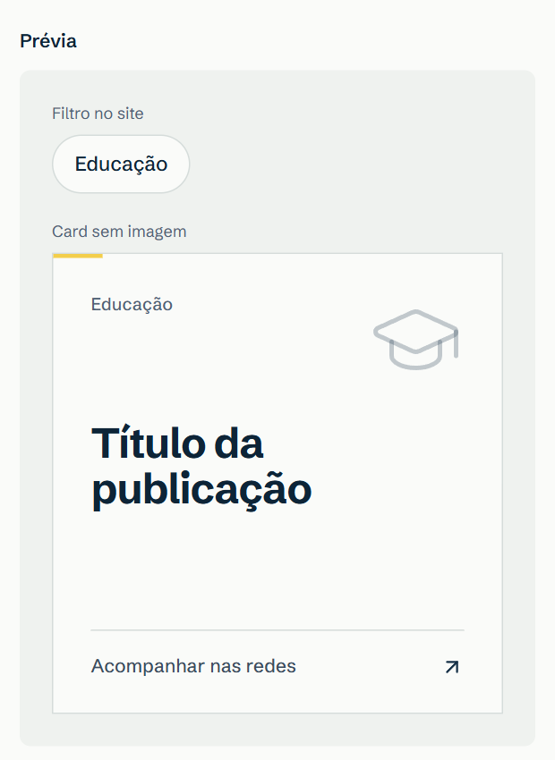

Opções: Saúde, Inclusão, Bairros, Educação, Segurança, Transporte, Meio ambiente, Esporte, Cultura, Social, Trabalho, Infraestrutura e Geral. Os três primeiros são os símbolos originais de Saúde, Inclusão e Bairros. Escolha o que melhor representa o assunto.

### 5.4 Editar uma categoria

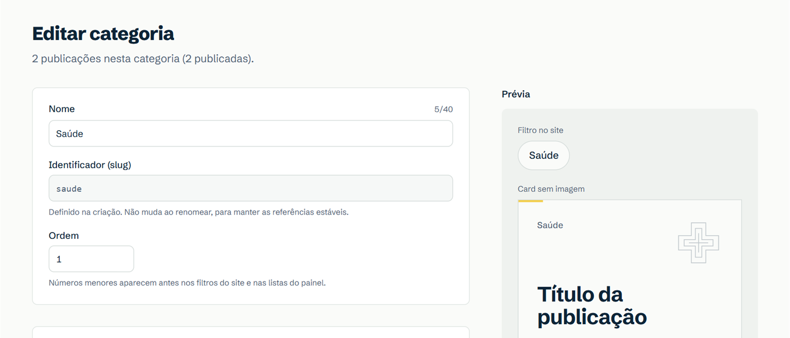

1. Em **Categorias**, clique em **Editar** ou no nome da categoria.
2. Altere o nome, o ícone ou a ordem.
3. Clique em **Salvar alterações**.

> **Renomear não afeta as publicações:** ao alterar o nome de uma categoria, todas as publicações vinculadas continuam nela e passam a exibir o novo nome automaticamente. O identificador (slug) permanece o mesmo.

### 5.5 Reorganizar categorias

A ordem das categorias define a sequência dos filtros no site e das listas no painel. Na lista de **Categorias**, use as setas de cada linha: a seta para cima sobe a categoria uma posição e a seta para baixo desce. A mudança é salva na hora. Também é possível informar um número no campo **Ordem**, na edição da categoria.

### 5.6 Excluir uma categoria

> **REGRA IMPORTANTE — Uma categoria com publicações não pode ser excluída.**
> O painel nunca apaga publicações junto com uma categoria. Isso protege o conteúdo contra exclusões acidentais. Publicações em rascunho também contam.

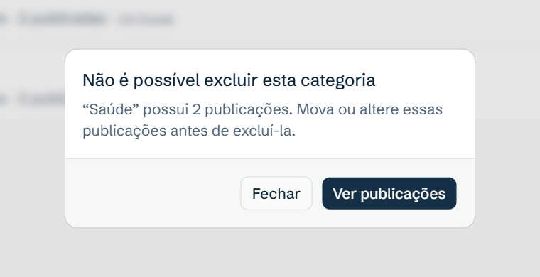

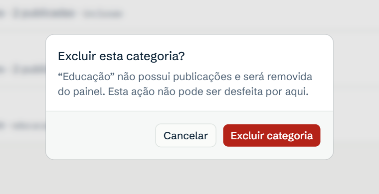

#### Se a categoria estiver em uso

1. Clique na lixeira da categoria e, na mensagem, em **Ver publicações**. A lista já abre filtrada.
2. Abra cada publicação, escolha outra **Categoria** e salve.
3. Volte para **Categorias** e confirme que ela mostra **0 publicações**.
4. Agora exclua a categoria.

#### Se a categoria estiver vazia

1. Clique na lixeira da categoria, ou em **Excluir** na tela de edição.
2. Confirme em **Excluir categoria**, ou clique em **Cancelar**.

A exclusão é definitiva e não pode ser desfeita pelo painel.

---

## 6. Filtros no site

Na seção **Atuação em destaque**, os visitantes podem filtrar os cards por assunto. Esses filtros são criados automaticamente a partir das categorias:

- aparece como filtro toda categoria que tenha **pelo menos uma publicação publicada**;
- categorias sem publicações, ou só com rascunhos, não aparecem no site;
- ao criar uma categoria e publicar conteúdo nela, o novo filtro surge sozinho, após a atualização do site. Não é preciso pedir alteração técnica.

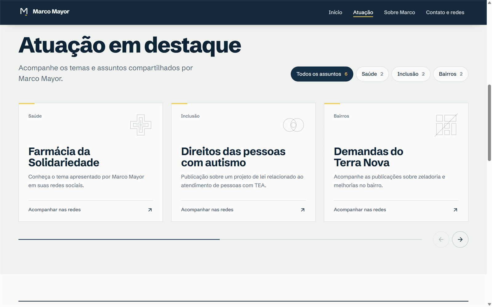

> **Ordem dos filtros:** os filtros seguem a ordem das categorias definida no painel (seção 5.5). O primeiro filtro, “Todos os assuntos”, é fixo e mostra todas as publicações publicadas.

---

## 7. Salvei uma alteração. Por que ainda não apareceu?

Toda alteração salva no painel passa por um processo automático antes de aparecer no site:

1. **Registro** — ao salvar, a alteração é registrada e o painel mostra a confirmação.
2. **Nova versão** — uma nova versão do site é preparada automaticamente.
3. **No ar** — depois de alguns instantes, a mudança aparece no site público.

### Enquanto aguarda

- Aguarde alguns instantes e **atualize a página** do site.
- **Evite salvar várias vezes** achando que houve erro: cada salvamento inicia uma nova atualização.
- O painel já mostra a informação nova logo após salvar; a demora é apenas no site público.
- Imagens novas podem levar alguns instantes a mais para aparecer (seção 4.3).

> **Duas pessoas editando ao mesmo tempo:** se outra pessoa salvar uma alteração enquanto você edita, o painel mostra “O conteúdo foi alterado por outra sessão. Recarregue a página para ver a versão atual.” Clique em **Recarregar** e refaça sua alteração. Assim, nenhuma mudança é sobrescrita por engano.

---

## 8. Boas práticas

**Publicações**

- Use títulos objetivos.
- Escreva resumos curtos e claros, fiéis à publicação original.
- Prefira imagens de boa qualidade.
- Revise o texto e a pré-visualização antes de publicar.
- Verifique se a categoria está correta.
- Na dúvida, salve como rascunho e publique depois.

**Categorias**

- Evite criar categorias muito parecidas.
- Prefira nomes curtos.
- Use uma categoria existente quando fizer sentido.
- Escolha um ícone coerente com o assunto.
- Antes de excluir, mova as publicações para outra categoria.

**Segurança**

- Não compartilhe usuário e senha.
- Use **Sair** ao terminar, principalmente em computadores compartilhados.
- Evite acessar o painel em redes públicas desconhecidas.

---

## 9. Dúvidas e problemas comuns

**Salvei, mas ainda não apareceu no site.**
Aguarde alguns instantes e atualize a página. O site é atualizado automaticamente depois de cada alteração (capítulo 7).

**A imagem não apareceu imediatamente.**
É normal: imagens novas só são exibidas depois que o site termina de atualizar. Aguarde e atualize a página, sem enviar a imagem de novo.

**Criei uma publicação, mas ela não aparece no site.**
Verifique se ela está marcada como **Publicada**. Rascunhos não aparecem no site. Se estiver publicada, aguarde a atualização.

**Não consigo excluir uma categoria.**
Ela provavelmente possui publicações vinculadas, inclusive rascunhos. Mova essas publicações para outra categoria e tente novamente (seção 5.6).

**Criei uma categoria, mas o filtro não aparece no site.**
O filtro só aparece quando a categoria tem pelo menos uma publicação publicada. Depois disso, aguarde a atualização do site.

**O painel diz que já existe uma categoria com esse nome.**
Os nomes não podem se repetir, mesmo com diferenças de maiúsculas, espaços ou acentos. Use a categoria existente ou escolha outro nome.

**As opções “Mover para cima” e “Mover para baixo” sumiram.**
Elas ficam ocultas quando há busca ou filtro ativo na lista de publicações. Limpe a busca e os filtros.

**Apareceu “O conteúdo foi alterado por outra sessão”.**
Outra pessoa salvou uma alteração ao mesmo tempo. Clique em **Recarregar** e refaça a sua alteração.

**A imagem foi recusada.**
Use um arquivo JPG, JPEG, PNG ou WebP. Se o arquivo for muito grande, escolha outra imagem ou uma versão menor.

**Fui desconectado do painel.**
O acesso expira depois de algumas horas, por segurança. Entre novamente com seu usuário e senha.

**Esqueci minha senha ou o acesso foi bloqueado.**
Após várias tentativas incorretas, aguarde os minutos indicados na tela. Se esqueceu a senha, entre em contato com o responsável técnico ou com o administrador do site.

---

Manual do Administrador · Site Marco Mayor · Versão 1.0 · Setembro de 2026
Em caso de dúvidas não previstas neste manual, entre em contato com o responsável técnico do site.

---

## Como gerar o PDF (uso interno)

O PDF é gerado a partir de `manual-administrador.html` com o Microsoft Edge ou o Google Chrome em modo sem janela, que respeitam o tamanho A4, o cabeçalho e a numeração definidos em `manual.css`:

```powershell
$html = (Resolve-Path docs\manual\manual-administrador.html).Path
$tmp  = Join-Path $env:TEMP "manual-impresso.pdf"
$pdf  = Join-Path (Resolve-Path docs\manual).Path "Manual_Administrador_Marco_Mayor.pdf"
$url  = "file:///" + ($html -replace '\\','/' -replace ' ','%20')
& "C:\Program Files (x86)\Microsoft\Edge\Application\msedge.exe" --headless=new --disable-gpu --no-pdf-header-footer --virtual-time-budget=15000 --print-to-pdf="$tmp" $url
python docs\manual\tools\add_actualtext.py $tmp $pdf
```

O segundo comando (requer `pip install pymupdf`) não altera a aparência do PDF: ele apenas registra o texto exato dos títulos, para que a busca (Ctrl+F), o copiar/colar e os leitores de tela não juntem as palavras. Sem ele, os títulos grandes podem ser lidos como “Nestemanual”.

A fonte Schibsted Grotesk (licença SIL Open Font License, texto em `fonts/OFL.txt`) está incluída em `fonts/`, então o PDF não depende de internet. Depois de gerar, confira todas as páginas: nenhuma captura cortada, nenhum título sozinho no fim da página.
